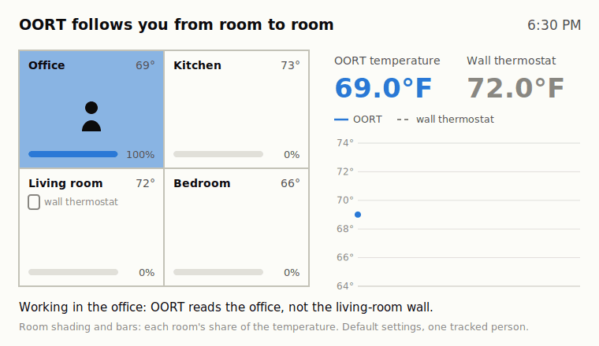
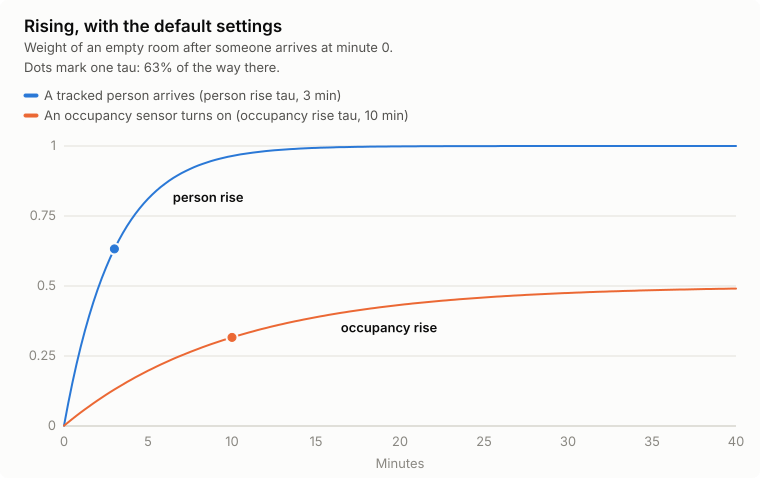
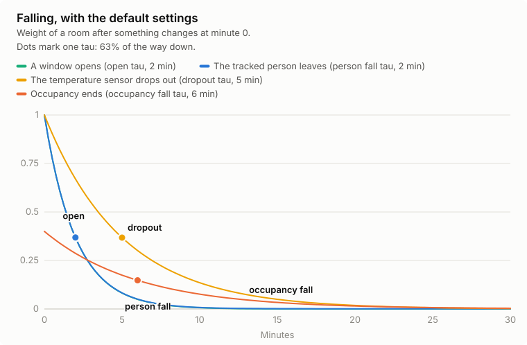
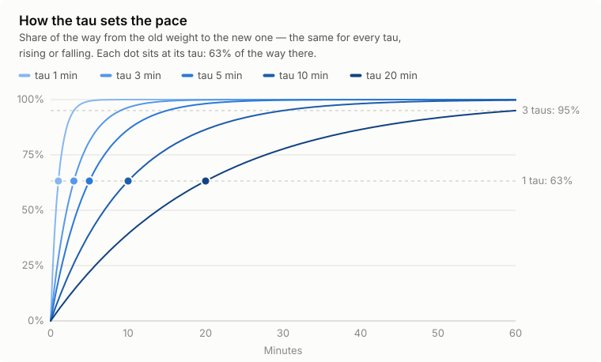
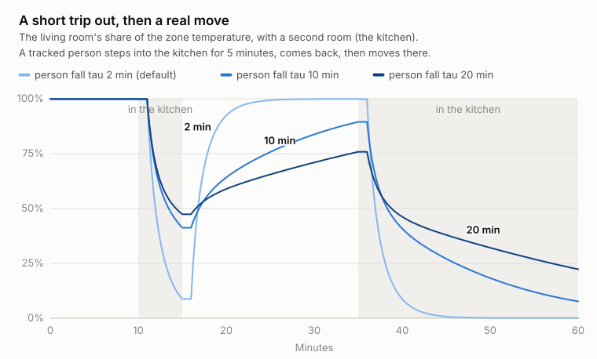

#  Overengineered Occupied-Room Temperature (OORT)

A [Home Assistant](https://www.home-assistant.io/) custom integration that keeps the rooms you're actually in at your chosen temperature, on a whole-home (single-zone) HVAC system.

OORT watches who and what is in each of your rooms and blends their temperature sensors into one occupancy-weighted number, which you point your thermostat's "current temperature" at instead of a single fixed sensor. It works with any thermostat that can take an external temperature sensor as its input.



OORT doesn't talk to any hardware itself. It reads sensors and template results you already have, and produces new sensors for your thermostat to use.

## Why OORT?

I live in a split-level house whose lower floor is partly underground. A furnace heats every room, but the air conditioning we added later only reaches upstairs. Here in the Pacific Northwest there was no practical way to run a return duct from upstairs down to the furnace for one shared system. Each has its own thermostat, and a single thermostat in Home Assistant drives both.

Even before the AC, rooms could be 5–10 °F apart, so wherever the temperature was measured, someone was uncomfortable. Remote room sensors didn't solve it. With my wife in the cool downstairs and me in my warm upstairs office, the average suited neither of us. When one of us changed floors, the thermostat was slow to notice, then overcorrected once the room it had been favouring finally dropped out.

Motion sensors brought their own problem: our dogs and cats. Hold each room's occupancy for a long time after motion stops, and the pets kept nearly every room in the average. Shorten the hold, and the HVAC flapped between heating and cooling, overcorrecting each time.

So I built my own out of template sensors and automations, weighting each room by who was in it and using my own temperature and occupancy sensors. Years of tweaking left it far more complicated than it needed to be, and painful to test: every change meant restarting Home Assistant, then waiting to see what happened.

OORT is that logic rebuilt as a proper integration. A tracked person counts for more than a motion sensor, each room fades in and out at its own pace, and short visits can be ignored altogether. It's configured in the UI, covered by tests and tunable per room. The name admits the rest.

## Table of contents

- [Why OORT?](#why-oort)

**Getting started**

- [Is this for me?](#is-this-for-me)
- [Installation](#installation)
- [Quick start](#quick-start)
- [How it works](#how-it-works)
- [Pointing your thermostat at OORT](#pointing-your-thermostat-at-oort)
- [Examples](#examples)

**Reference**

- [Configuration](#configuration)
  - [Create a zone](#create-a-zone)
  - [Change a zone later](#change-a-zone-later)
  - [Settings](#settings)
  - [Tuning the taus](#tuning-the-taus)
  - [Rooms](#rooms)
  - [People](#people)
- [Entities](#entities)
- [Data updates](#data-updates)
  - [Recorder and database size](#recorder-and-database-size)
- [Fallback and stale sensors](#fallback-and-stale-sensors)
- [Startup grace period](#startup-grace-period)
- [Known limitations](#known-limitations)
- [Troubleshooting](#troubleshooting)
- [Removing the integration](#removing-the-integration)
- [Contributing](#contributing)
- [License](#license)

## Is this for me?

- You have **one whole-home HVAC system** (a single zone) and want it to prioritize the rooms people are actually using, rather than a single fixed thermostat location.
- Your thermostat entity (or the climate integration that drives it) can be configured to use an **external sensor as its current temperature** — for example Home Assistant's [Generic Thermostat](https://www.home-assistant.io/integrations/generic_thermostat/), a `dual_smart_thermostat`, or any similar `climate` integration with a "target sensor" / "current temperature sensor" option. OORT doesn't control climate entities directly; it only produces a temperature sensor for you to wire in yourself.
- You have (or are willing to set up) a temperature sensor per room, and some way to detect occupancy per room — motion/occupancy sensors, input booleans, templates, or per-person room-location sensors (anything whose state or an attribute is the name or ID of the Home Assistant area the person is in, such as a room-presence integration or a template sensor). A `person` or `device_tracker` entity on its own isn't enough: its state is a zone, not an area.
- You run **Home Assistant 2026.9 or later**. Tests run against 2026.9.3.

## Installation

There's no HACS listing yet (planned for later). Install manually:

1. Copy the `custom_components/overengineered_occupied_room_temperature` folder from this repository into your Home Assistant config's `custom_components/` directory, so you end up with `<config>/custom_components/overengineered_occupied_room_temperature/`.
2. Restart Home Assistant.

Then follow the [Quick start](#quick-start).

## Quick start

1. [Install OORT](#installation).
2. Go to **Settings → Devices & services → Add integration**, choose **Overengineered Occupied-Room Temperature**, and name the zone, for example "Home". Or use this button, which opens it in your own Home Assistant:

   [](https://my.home-assistant.io/redirect/config_flow_start/?domain=overengineered_occupied_room_temperature)
3. In the zone menu, choose **Rooms**, then **Add a new room**. Pick the room's area, its temperature sensor, and its motion or occupancy sensors, and submit. Repeat for each room the HVAC serves, then choose **Done**.
4. Optional: choose **People** and add each person whose room you can track, using an entity whose state (or an attribute) is the area they're in. With the default settings, a tracked person counts 2.5 times as much as an occupancy sensor (1.0 against 0.4).
5. Choose **Finish**. The default settings suit most homes.
6. [Point your thermostat](#pointing-your-thermostat-at-oort) at `sensor.oort_home_temperature`. You can leave the thermostat as it is for a day or two first and compare the new sensor with your current reading.

Each room gets a `sensor.oort_home_<room>_weight` sensor whose attributes show why it has the weight it has (see [Entities](#entities)). If the temperature follows you too eagerly or too slowly, see [Tuning the taus](#tuning-the-taus).

## How it works

For each room you configure, OORT tracks a **weight** between 0 and 1, driven by what's happening in that room right now:

| Status | Meaning | Target weight |
|---|---|---|
| `person` | A configured person is located in this room | *Person weight* (default `1.0`) |
| `occupied` | An occupancy sensor or template says the room is occupied, but no tracked person is in it | *Occupied weight* (default `0.4`) |
| `unoccupied` | Neither of the above | *Unoccupied weight* (default `0.001`) |
| `open` | An opening entity is on, or the opening template is true — the room is left out | `0` |
| `dropout` | The room's temperature sensor has no usable reading — the room is left out | `0` |

The first matching status applies, in the order `open`, `dropout`, `person`, `occupied`, `unoccupied`. Despite its name, `open` covers anything you want a room left out for: an open window, a space heater, a thermostat mode (see [Examples](#examples)).

The weight doesn't jump straight to its target — it moves there exponentially, over a configurable time constant (a "tau", in minutes) that's different for rising into a status and falling out of it. This smooths out someone briefly walking through a room, or a motion sensor's usual on/off flicker.

Optional **delays** go further. With an **enter delay**, a room ignores a person (or occupancy) until they've been there that long, so passing through — or a room-presence sensor briefly flipping someone into the room — doesn't count at all. With an **exit delay**, it keeps counting them for that long after they leave, which rides out a location that briefly flips away. By default a room waits 1 minute before it counts a person or occupancy; exit delays are off (`0`).

Every minute, and whenever something relevant changes, OORT recomputes each room's weight and averages the rooms' temperatures, each counting in proportion to its weight. That average is the zone's `Temperature` sensor, which your thermostat reads. The exact formula is under [Fallback and stale sensors](#fallback-and-stale-sensors).

## Pointing your thermostat at OORT

Wire the `Temperature` sensor into whatever climate integration is driving your HVAC. For example, with Home Assistant's built-in [Generic Thermostat](https://www.home-assistant.io/integrations/generic_thermostat/) (`configuration.yaml`):

```yaml
climate:
  - platform: generic_thermostat
    name: House
    heater: switch.hvac_heater
    target_sensor: sensor.oort_home_temperature
```

Any other climate integration with an equivalent "current/target temperature sensor" option — including UI-configured ones — works the same way: point that option at your zone's `sensor.oort_<zone>_temperature`.

## Examples

Each of these is set on a room's form (**Configure → Rooms**, then the room), with times and weights under its **Overrides**, or on the **Settings** screen for every room at once.

### Pets tripping motion sensors

A dog or cat wandering through sets off a room's motion sensor for a minute or two, and without a fix, that room joins the average each time.

- Give the room an **occupancy enter delay** a little longer than the time the motion sensor stays on after one trigger. If the sensor stays on for 2 minutes, a delay of 3 minutes ignores a pet passing through. Someone who stays and moves about keeps the sensor on, so the room counts after 3 minutes. The delay starts again after every gap, so it suits sensors that stay on for a while after each trigger.
- Where you can, add **people**. A tracked person counts for more than motion (by default 1.0 against 0.4), and lowering the **occupied weight** makes motion-only rooms count for even less.

### Leave a room out while its window is open

An open window makes the room's reading say more about the weather than about the house. Add the window's contact sensor to the room's **opening entities**: while it's on, the room fades out of the average at the open tau (2 minutes by default) and comes back once it closes.

### Leave out a room with its own heat source

A space heater, a fireplace or a busy 3D printer warms its own room. The room's reading then says nothing about the rest of the house, and if the room counts, the HVAC backs off for everyone else. An opening doesn't have to be a window: anything that makes a room's reading misleading can leave it out.

The opening entities field takes `binary_sensor` and `input_boolean` entities only, so for a heater on a smart plug use the room's **opening template**:

```jinja
{{ is_state('switch.office_space_heater', 'on') }}
```

or, if the plug reports power:

```jinja
{{ states('sensor.office_heater_power') | float(0) > 50 }}
```

The room fades out while the heater runs and fades back in after it stops. Window contacts can stay in the opening entities; the room is left out if either says so.

### Keep a room counted despite an open window

Sometimes an open window is fine, such as a bedroom window left open at night with everyone asleep in that room. Move the window from the opening entities into the **opening template**, with the exception written in:

```jinja
{{ is_state('binary_sensor.bedroom_window', 'on')
   and not is_state('input_boolean.gone_to_bed', 'on') }}
```

The bedroom is left out while its window is open during the day, but keeps counting once everyone has gone to bed.

### Count only some rooms in a thermostat preset

If your thermostat has presets, a room's **opening template** can leave it out in some of them, for example the offices while the house is asleep or away:

```jinja
{{ state_attr('climate.house', 'preset_mode') in ['sleep', 'away'] }}
```

Preset names depend on your thermostat; its `preset_mode` attribute shows the current one. Keep at least one room counted in every preset.

### Leave out rooms the AC doesn't reach

If your air conditioning only serves some rooms, leave the others out while cooling with an **opening template** on each of them. With a thermostat entity called `climate.house`:

```jinja
{{ is_state('climate.house', 'cool') }}
```

A climate entity's state is its HVAC mode, so this is true while the system is set to cool. The rooms rejoin when it's set back to heat. In a heat/cool or auto mode the template stays false, so those rooms stay counted even while the AC runs.

### Count the bedroom once someone has gone to bed

Motion sensors see little of people asleep. Give the bedroom an **occupancy template** that's true while someone is in bed, for example with an input boolean your bedtime routine turns on:

```jinja
{{ is_state('input_boolean.gone_to_bed', 'on') }}
```

Occupancy counts at the **occupied weight**, so raise the bedroom's to 1.0 if it should count as much as a tracked person.

### Rooms people walk through

A hallway, or the kitchen on the way to the garage, briefly pulls the temperature toward it every time someone passes. The default enter delays (1 minute) ignore most walk-throughs; if a room still pulls the temperature, raise its **person enter delay** and **occupancy enter delay** under its Overrides, so it only counts people who stop there.

### A room-presence sensor that flips people between rooms

Room-presence sensors sometimes place someone in the next room for a few seconds. The default **person enter delay** keeps the room they flipped into from counting them. A **person exit delay** would keep counting them where they were, but it also keeps counting them after they really leave, so the temperature lags every real move; add one only if the flips last longer than the enter delay and you've checked it helps.

## Configuration

Everything is configured through the UI (there is no YAML configuration). OORT is organised in **zones**:

- **Zone** — one HVAC system and the rooms it serves. Its name feeds your entity IDs (a zone named "Home" produces `sensor.oort_home_temperature`). Most homes need one zone; add more for multi-zone HVAC. Each zone is completely independent.
- **Rooms** — each room is one Home Assistant area with its temperature sensor, its occupancy sources, and optional overrides of the zone's defaults.
- **People** (optional) — each person is an entity that says which area they're in.

Rooms and people belong to their zone and are managed only from that zone's menu.

### Create a zone

**Settings → Devices & services → Add integration → Overengineered Occupied-Room Temperature.**

1. **Name the zone** (for example "Home"). The name must not already be used by another OORT zone.
2. **The zone menu** opens, showing the rooms and people added so far:
   - **Settings** — the rooms' default taus, delays and weights, and the zone-wide stale-temperature limit (see below). Optional: the defaults work for most homes.
   - **Rooms** — add, edit or remove rooms.
   - **People** — add, edit or remove people.
   - **Finish** — creates the zone. It appears once the zone has at least one room.

Nothing is saved until you choose **Finish**; closing the dialog earlier discards the new zone.

### Change a zone later

On the integration's page (**Settings → Devices & services → Overengineered Occupied-Room Temperature**), press **Configure** on the zone. The same menu opens, pre-filled, with **Save** instead of Finish (again only while the zone has at least one room). Saving reloads the zone. Closing without saving changes nothing.

To rename a zone, use Home Assistant's own **Rename** in the zone's ⋮ menu. The device name follows; existing entity IDs keep the old name (rename them in the entity settings if you want).

### Settings

The **Settings** screen has the rooms' defaults (every room uses these unless it overrides them) and, in its **Zone** section, settings for the whole zone.

Each field's description ends with the integration's default, and says "yours differs" when your value isn't it. While any setting differs, the screen also offers **Restore defaults**: tick it and submit, and the form comes back filled with the defaults to review (change any you want to keep), then submit again and **Save**. Use it after an update to pick up new defaults. Room overrides are kept.

Times are in minutes. A **tau** is a time constant: roughly how long a room's weight takes to get two-thirds of the way to its new value — smaller reacts faster, larger is smoother. **Weights** (0 to 1) say how much each room counts; only their ratios matter.

| Field | Description | Default |
|---|---|---|
| Person rise tau | How fast a room's weight rises when a tracked person arrives. | 2 |
| Person fall tau | How fast it falls after the last tracked person leaves — including while an occupancy sensor there is still on. Larger keeps a room counted during short trips out. Also used when a room becomes occupied while its weight is still above the occupied weight — for example when motion returns, or after a brief open period or dropout, while it is still falling after a person left. | 2 |
| Occupancy rise tau | How fast it rises when an occupancy sensor or template says someone is there (and no tracked person is). Also used when an empty room climbs back up to the unoccupied weight — for example after being open, or when it's new. | 10 |
| Occupancy fall tau | How fast it falls after occupancy ends. | 6 |
| Open tau | How fast a room fades out when it becomes "open" (an opening entity turns on, or the opening template turns true). `0` = instantly. | 2 |
| Sensor dropout tau | How fast a room fades out when its temperature sensor becomes unavailable. `0` = instantly. | 5 |
| Person enter delay | How long a tracked person must stay in a room before it counts them. Ignores people passing through, or a location that briefly flips to this room. `0` = at once. | 1 |
| Person exit delay | How long a room keeps counting a tracked person after they leave. Ignores a location that briefly flips away. `0` = at once. | 0 |
| Occupancy enter delay | How long an occupancy sensor or template must stay on before the room counts as occupied. `0` = at once. | 1 |
| Occupancy exit delay | How long the room keeps counting as occupied after its occupancy sensors and template go off. `0` = at once. | 0 |
| Person weight | Target weight while a tracked person is in the room. | 1.0 |
| Occupied weight | Target weight while the room is occupied but no tracked person is in it. | 0.4 |
| Unoccupied weight | Target weight otherwise. Must be at least 0.001. | 0.001 |
| Stale temperature limit | How long a room's last reading keeps being used after its temperature sensor was last seen working, before the room is left out. The default covers a normal restart or integration reload (sensors are usually back within seconds to a few minutes); after a longer downtime the saved readings are already stale. In the **Zone** section; rooms can't override it. | 5 |

Validation: person and occupancy taus must be greater than 0; open and dropout taus and delays can't be negative; weights can't be negative; the unoccupied weight must be at least 0.001 and the stale limit greater than 0. Upper limits: taus and the stale limit at most 1440 minutes (a day), delays at most 60 minutes, weights at most 1.

A delay is timed from when the change starts; a change that reverts before its delay is up is forgotten, and the next one starts its own delay. Delays apply to the room, not to each person: a person enter delay is how long the room must have *someone* in it without a break, so if one person walks in just before another leaves, the wait carries on from the first arrival — and people coming and going with gaps in between never count. Delays carry on across a restart, and time spent down counts toward them. A delay and the tau add up: a person with a 1-minute enter delay starts pulling the weight up after that minute, at the person rise tau; with a 2-minute exit delay, the weight starts falling 2 minutes after they leave, at the person fall tau.

### Tuning the taus

The defaults suit most homes. These charts show what they do, and how a different tau would change it.

With the default settings, a room's weight rises like this when someone arrives. It starts rising after the enter delay (1 minute by default):



and falls like this when something changes:



Every tau follows the same curve, stretched in time. After one tau the weight has covered 63% of the distance to its new target, after three taus 95%:



| Tau | Halfway | 90% | 95% | 99% |
|---|---|---|---|---|
| 2 min (person rise, person fall, open) | 1.4 min | 4.6 min | 6 min | 9.2 min |
| 5 min (dropout) | 3.5 min | 12 min | 15 min | 23 min |
| 6 min (occupancy fall) | 4.2 min | 14 min | 18 min | 28 min |
| 10 min (occupancy rise) | 6.9 min | 23 min | 30 min | 46 min |
| any tau | 0.69 × tau | 2.3 × tau | 3 × tau | 4.6 × tau |

What the thermostat sees is each room's **share** of the total weight, so a tau matters most when people move between rooms. In this example a tracked person steps out of the living room into the kitchen for 5 minutes, comes back, and 20 minutes later moves to the kitchen for good. The chart shows the living room's share of the zone temperature for three person fall taus:



- **2 minutes (default):** the zone follows the person closely. The living room's share drops to 10% during the trip, and after the real move it's under 5% within 7 minutes.
- **10 or 20 minutes:** the living room stays at 42–48% through the trip, so short trips out barely move the temperature. The cost comes after a real move: 10 minutes later the living room still makes up 27% (tau 10) or 38% (tau 20). The kitchen falls just as slowly after the trip, which is why the living room only gets back to 76–89% before the move.

Rules of thumb:

- **Person rise** and **occupancy rise**: raise them if walking through a room (a hallway, the kitchen on the way to the garage) pulls the temperature around; lower them if the system takes too long to notice where you are.
- **Person fall** and **occupancy fall**: raise them to keep a room counted through short trips out, or through gaps in a motion sensor that goes off while you sit still. Lower them if the temperature keeps following a room you have left.
- **Open**: keep it short. An open window soon makes the room's reading misleading.
- **Dropout**: long enough to ride out a sensor briefly going offline, short enough that a dead sensor isn't trusted for long. Its last reading is dropped anyway once the stale limit passes.
- **Delays**: use a delay rather than a longer tau when short events shouldn't count at all. The default person enter delay of 1 minute ignores most walk-throughs; a person exit delay can ride out a room-presence sensor that flips people between rooms, but it also delays every real move, so try it only if the enter delay isn't enough. An occupancy exit delay is usually unnecessary if the motion sensor already holds itself on for a while.

Taus and delays can be set for the whole zone on the **Settings** screen, or for one room under its **Overrides**, for example a longer occupancy fall tau for a room with a twitchy motion sensor.

### Rooms

**Rooms** shows a list: your rooms, then **Add a new room** and **Done**. Pick a room to edit it; saving a room brings you back to the list.

| Field | Description |
|---|---|
| Area | The Home Assistant area this room is. Chosen when the room is added and fixed after that — to use a different area, remove the room and add a new one. An area can be a room once per zone (the same area can also be a room in another zone). |
| Temperature sensor | A `sensor` with device class `temperature` measuring this room. |
| Occupancy sensors | Any number of `binary_sensor` or `input_boolean` entities. The room counts as occupied while any of them is `on`. |
| Occupancy template | When true, the room also counts as occupied. |
| Opening entities | Any number of `binary_sensor` or `input_boolean` entities, like window or door contacts. While any of them is `on`, the room is left out and its weight fades to 0 (the `open` status). `unavailable` or `unknown` counts as closed. |
| Opening template | When it renders true, the room is also left out. True means `true`, `on`, `yes`, `enable`, or any number other than `0` — Home Assistant's usual rule, so a template that returns a number (a temperature, a count) by mistake keeps the room out. Anything else — including `unavailable`, `unknown` or a template error — counts as false. Errors, and results that aren't a recognisable true/false, are logged. Leave both opening fields blank to always count the room. |
| Overrides (collapsed) | Any of the taus, delays and weights above, for this room only. Leave a field blank to use the zone's default. |
| Remove this room | Only when editing: removes the room when you submit. |

If you save a room with no occupancy sensors and no occupancy template while the zone has no people yet, a note says the room can never count as occupied. The room is saved anyway — useful if you're about to add people.

### People

**People** works the same way: your people, then **Add a new person** and **Done**. Adding or editing a person takes two steps:

1. **Name** (shown in each room's `people` attribute) and **location entity** — an entity whose state, or one of its attributes, is the area the person is in. When editing, a **Remove this person** switch appears here.
2. **Attribute** (optional — leave blank to use the entity's state) and whether the value is an **area name** (e.g. "Living Room") or an **area ID** (e.g. `living_room`). The entity's current state is shown to help.

A person only affects a room if their value matches one of this zone's rooms. Anything else — an area with no room here, `not_home`, `unavailable`, a value that isn't an area — counts as "not in any room". A `person` or `device_tracker` entity on its own reports a zone (like `home`), not a room, so it isn't enough.

## Entities

Each zone creates one device ("OORT `<zone name>`") containing:

- One **`<Room> weight`** sensor per room: `sensor.oort_<zone>_<room>_weight`
- One **Temperature** sensor for the zone: `sensor.oort_<zone>_temperature`

(For example, a zone named "Home" with a "Kitchen" room gives `sensor.oort_home_kitchen_weight` and `sensor.oort_home_temperature`.)

### `<Room> weight` sensor

Its state is the room's current weight (a number between 0 and the largest of the room's weights), stored to 4 decimal places (see [Data updates](#data-updates) for when it's written). Attributes:

| Attribute | Meaning |
|---|---|
| `area_id` | The ID of the room's Home Assistant area. |
| `status` | `open`, `dropout`, `person`, `occupied`, or `unoccupied` — see [How it works](#how-it-works). |
| `open` | `true` while an opening entity is on or the opening template is true; otherwise `false`. |
| `temperature_available` | Whether the room's temperature sensor currently has a usable reading. |
| `temperature_stale` | `true` once the temperature sensor hasn't had a usable reading for longer than the stale limit (counted from when it was last seen working; time Home Assistant spends down doesn't count) — see [Fallback and stale sensors](#fallback-and-stale-sensors). |
| `person_present` | Whether a tracked person counts as present in this room, after the person enter and exit delays. |
| `occupied` | The combined result of the room's occupancy sensors and occupancy template, after the occupancy enter and exit delays. |
| `people` | The names of the people in this room while `person_present` is `true` — while an exit is delayed, the people last seen here. Empty otherwise. |
| `target_weight` | The weight this room is currently moving toward. |
| `tau` | The time constant (minutes) currently used to move toward `target_weight`. |
| `tau_name` | Which tau that is: `person_rise`, `person_fall`, `occupancy_rise`, `occupancy_fall`, `open` or `dropout` — so you can see both the direction and the reason. |
| `last_occupied_state` | The last status that was `person` or `occupied` (used to pick the correct fall tau); `null` if the room has never been occupied. |

Each room's state is restored across a Home Assistant restart and when the zone is reloaded or reconfigured: its weight, status and last reading. The downtime itself isn't counted as elapsed time — the room resumes at the weight it had before rather than jumping as if time had passed. The saved reading is reused until the sensor reports again; it goes stale on the usual stale limit, counting only time Home Assistant is running. A room whose weight sensor is disabled isn't saved, so it starts again from 0 after every restart or reload.

### `Temperature` sensor

Its state is the zone's occupancy-weighted temperature, rounded to 0.1°, in the temperature unit Home Assistant was set to when you created the zone (sensor readings in other units are converted automatically). The zone keeps that unit even if you later change Home Assistant's unit system; Home Assistant converts it for display as it does for any other temperature sensor. It becomes `unavailable` when nothing can be averaged — see below. Attributes:

| Attribute | Meaning |
|---|---|
| `contributing_rooms` | How many rooms are steering the weighted average: they have a valid temperature and a weight that shows as more than 0 (at least 0.00005). An open room drops out of the count once its weight has faded; a new room joins once its weight starts rising. |
| `fallback` | `true` when the fallback term's weight is more than the total weight of the rooms with a usable reading — see below. |

## Data updates

OORT doesn't poll anything. It recalculates a zone:

- when something it watches changes: a room's temperature, occupancy or opening sensors, the result of one of its templates, or a person's location entity;
- when an enter or exit delay ends;
- every minute, so weights keep moving between events.

A recalculation doesn't always write the sensors, which keeps history (and the database) smaller:

- A **`<Room> weight`** sensor is written straight away when any of its attributes change, such as its status. In between, it's written on the minute timer once its weight has moved at least 0.01 since it was last written, and once more when the weight reaches its target, so a settling weight can show up to 0.01 off until it settles. A new temperature reading on its own doesn't write it. The zone's temperature always uses the exact weights.
- The **`Temperature`** sensor is written only when its rounded value, `contributing_rooms` or `fallback` changes.

### Recorder and database size

Measured on a nine-room zone in a two-person house: about **4,000 history rows a day** — about 1,300 from the `Temperature` sensor and the rest from the weight sensors, busy rooms writing far more than quiet ones. Home Assistant keeps history for 10 days by default (`purge_keep_days`). Every OORT sensor also gets hourly long-term statistics, which are never purged: about 8 MiB a year for that zone in SQLite.

If you don't need the weights' history, exclude them from the recorder and keep the `Temperature` sensor:

```yaml
recorder:
  exclude:
    entity_globs:
      - sensor.oort_*_weight
```

Excluded weight sensors keep working, and the zone's temperature still uses them. They lose their history graphs and long-term statistics.

## Fallback and stale sensors

Every room's temperature sensor is read continuously, whether or not the room is open. If a room's sensor becomes unavailable, unknown, or reports a value or unit Home Assistant can't convert to a temperature (including `nan` or `inf`), the room (status `dropout`) keeps using its **last known reading** while its weight fades out at the dropout tau. If the sensor stays unusable for longer than the zone's **stale temperature limit** (counted from when it was last seen working), that room's `temperature_stale` attribute becomes `true` and it's dropped from the average entirely (it still keeps its weight and status, it just no longer contributes a temperature).

The `Temperature` sensor is the rooms' weighted average plus a small **fallback term**:

```
temperature = Σ(room_weight × room_temperature) + ε × fallback_average
              ──────────────────────────────────────────────────────
              Σ(room_weight) + ε
```

The fallback term is a plain average of room readings, with a fixed weight `ε` of 1% of your smallest room's unoccupied weight. It's negligible next to any room with real weight, but it keeps the output sensible — rather than unavailable — while every room is fading toward zero (for example right after startup, or when every room is open).

The fallback averages the first of these that has any readings:

1. closed rooms' current readings;
2. closed rooms' last readings that aren't stale;
3. any room's current readings;
4. any room's last readings that aren't stale.

So an open room is used only when no closed room has a reading, and during a total sensor outage the output holds the last readings until they go stale.

The `fallback` attribute turns `true` when this term's weight is more than the total weight of the rooms with a usable reading — your cue that the temperature is closer to a whole-home average than to an occupancy-weighted one.

Last readings are saved across restarts, so a reboot or a longer outage doesn't make the output jump while sensors reconnect: time Home Assistant spends down doesn't count toward the stale limit. A sensor that still hasn't reported once the stale limit has passed after startup goes stale as usual.

The `Temperature` sensor becomes `unavailable` only when there's nothing at all to average — every room is either stale or has never reported a valid temperature.

So during a total sensor outage the thermostat gets the last readings for at most the stale limit (5 minutes by default), then `unavailable`. If your thermostat can turn itself off when its sensor is unavailable — the `sensor_stale_duration` option of the custom `dual_smart_thermostat` integration, for example — set that too, a little longer than OORT's stale limit.

## Startup grace period

When Home Assistant itself is starting, OORT holds every room's weight at whatever it was restored to (or 0, if there's nothing to restore) until **2 minutes** after Home Assistant has finished starting. Reloading or reconfiguring the integration while Home Assistant is already running doesn't start a grace period. Inputs, status and dropout tracking are still updated live during this hold — only the weight itself is frozen — so the very first minutes after a restart don't produce a temperature swung by rooms racing back up from 0.

## Known limitations

- Each zone creates a single device holding all of its room-weight and temperature sensors, rather than one device per room. Room sensors won't appear on their own room's area page in Home Assistant unless you manually assign each `<Room> weight` entity to that area (**Settings → Devices & services → Entities**).
- No HACS listing yet; manual installation only.
- A room's area can't be changed after the room is created — remove and re-add it instead.
- When you rename an entity a zone uses (a temperature, occupancy or opening sensor, or a person's location entity), the zone follows the new entity ID by itself and reloads. Entity IDs written inside templates aren't updated — edit those yourself.

## Troubleshooting

**Repairs shows "Some OORT rooms can never count as occupied".** This fires when a room has no occupancy sensors, no occupancy template, and the zone has no people configured — so that room can only ever sit at its unoccupied weight. Add occupancy sensors or a template to the room, or add a person to the zone — both from the zone's **Configure** menu. The issue clears automatically once either is true, or if the room is removed.

**Repairs shows "Some entities used by an OORT zone don't exist".** An entity the zone uses — a room's temperature, occupancy or opening sensor, or a person's location entity — has no registry entry and no state, once Home Assistant has started. The issue lists each one with the rooms or people using it. Usually the entity was deleted or its integration removed (renamed entities are followed automatically). Open the zone's **Configure** menu and choose a replacement, or bring the entity back; the issue clears itself once every entity exists.

**The `Temperature` sensor is `unavailable`.** Every configured room's temperature sensor is either stale (unavailable for longer than the stale limit) or has never reported a usable value. Check each room's `temperature_available` and `temperature_stale` attributes to find the affected sensor(s).

## Removing the integration

1. Point your thermostat back at its own temperature sensor first, or it will be left without a current temperature.
2. Go to **Settings → Devices & services → Overengineered Occupied-Room Temperature**. For each zone, open its ⋮ menu and choose **Delete**. This removes the zone's device and sensors.
3. Delete the `custom_components/overengineered_occupied_room_temperature` folder from your config and restart Home Assistant.

## Contributing

See [CONTRIBUTING.md](CONTRIBUTING.md) for setting up a development environment, the checks CI runs, and commit conventions.

## License

MIT — see [LICENSE](LICENSE).
